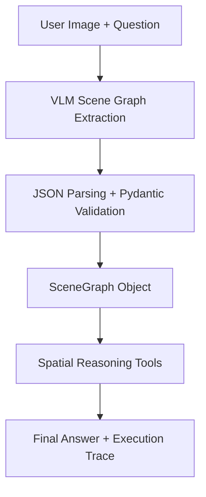

# spatial-vlm-agent
A lightweight multimodal agent for image-based spatial reasoning using vision-language models.

> Current status: Day 2 completed — structured scene graph extraction and lightweight spatial reasoning agent.

## Overview
This project explores how VLMs can be integrated with deterministic
spatial reasoning tools to build an interpretable agent pipeline.

The system:
1. Accepts an image and a natural language question
2. Uses a VLM to extract a structured scene graph (objects + relations)
3. Validates the scene graph with Pydantic
4. Answers spatial questions using Python-based reasoning tools
5. Returns the answer, the scene graph JSON, and an execution trace

## Architecture



## Demo


## Quick Start

### 1. Clone the repository
git clone https://github.com/<your-github-id>/spatial-vlm-agent.git

cd spatial-vlm-agent

### 2. Create a virtual environment
python -m venv .venv

Activate it:
```text
Windows PowerShell:
.venv\Scripts\Activate.ps1

macOS/Linux:
source .venv/bin/activate
```
### 3. Install dependencies
pip install -r requirements.txt

### 4. Configure API
Copy the example file:
```text
Windows (PowerShell)
Copy-Item .env.example .env

macOS / Linux
cp .env.example .env
```
Then fill in:
```text
VLM_API_KEY=your_api_key_here
VLM_BASE_URL=your_openai_compatible_base_url
VLM_MODEL=your_vision_model_name
```
Do not upload .env to GitHub.

### 5. Run
python app.py

Then open:
```text
http://127.0.0.1:7861
```
### 6.Running Tests
pytest -v

### 7.Running Evaluation
python scripts/run_evaluation.py


## Project Structure

```text
spatial-vlm-agent/
├── app.py                          # Gradio web interface
├── requirements.txt
├── README.md
├── .env.example
├── .gitignore
│
├── src/
│   ├── __init__.py
│   ├── agent.py                    # Agent workflow orchestration
│   ├── vlm_client.py               # VLM API client
│   ├── schemas.py                  # Pydantic data models
│   ├── scene_graph_parser.py       # JSON parsing and normalization
│   └── tools.py                    # Spatial reasoning tools
│
└── assets/
    ├── demo_screenshot.png

```
## Development Notes
The project uses an OpenAI-compatible API interface, allowing different VLM providers to be configured through environment variables.

The system prompt asks the model not to hallucinate objects and to explicitly indicate uncertainty when visual information is insufficient.

This is an early MVP. Current answers are generated directly by the VLM without explicit scene graph reasoning.
