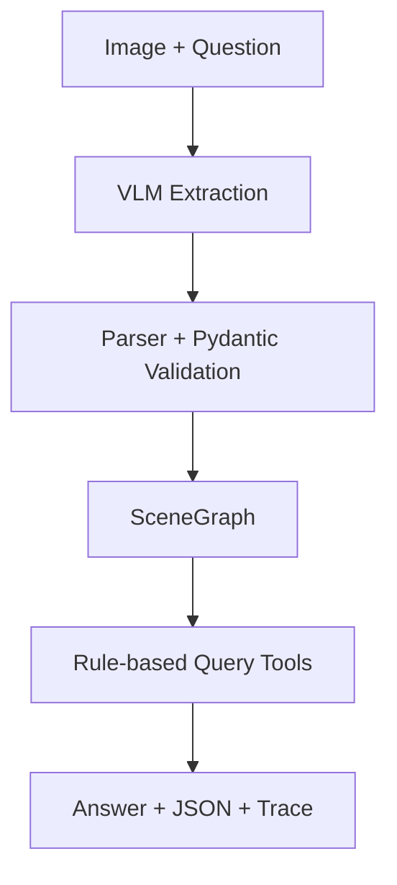

# spatial-vlm-agent
A lightweight multimodal agent for image-based spatial reasoning using vision-language models.


## Overview
This project builds a VLM-powered agent that extracts structured scene graphs from images and answers spatial questions via deterministic rule-based tools.

**Pipeline:**

1. Accept an image and a natural-language question.
2. Call a VLM to extract a scene graph (objects + spatial relations) and validate it with Pydantic.
3. Query the scene graph using rule-based reasoning tools.
4. Return the final answer, the structured JSON, and an execution trace.

## Architecture



## Demo


## Quick Start

### 1. Clone the repository
git clone https://github.com/Y-Claireo78/spatial-vlm-agent.git

cd spatial-vlm-agent

### 2. Create a virtual environment
python -m venv .venv

Activate it:
```text
Windows PowerShell:
.venv\Scripts\Activate.ps1

macOS/Linux:
source .venv/bin/activate
```
### 3. Install dependencies
pip install -r requirements.txt

### 4. Configure API
Copy the example file:
```text
Windows (PowerShell)
Copy-Item .env.example .env

macOS / Linux
cp .env.example .env
```
Then fill in:
```text
VLM_API_KEY=your_api_key_here
VLM_BASE_URL=your_openai_compatible_base_url
VLM_MODEL=your_vision_model_name
```
Do not upload .env to GitHub.

### 5. Run
python app.py

Then open:
```text
http://127.0.0.1:7860
```
### 6.Running Tests
pytest -v

### 7.Running Evaluation
python scripts/run_evaluation.py


## Project Structure

```text
spatial-vlm-agent/
├── app.py                          # Gradio web interface
├── requirements.txt
├── README.md
├── .env.example
├── .gitignore
│
├── src/
│   ├── __init__.py
│   ├── agent.py                    # Agent workflow orchestration
│   ├── vlm_client.py               # VLM API client
│   ├── schemas.py                  # Pydantic data models
│   ├── scene_graph_parser.py       # JSON parsing and normalization
│   └── tools.py                    # Spatial reasoning tools
│
├── tests/
│   ├── __init__.py
│   ├── test_schemas.py
│   └── test_tools.py
│
├── scripts/
│   └── run_evaluation.py           # Evaluation runner
│
├── data/
│   └── evaluation/
│       ├── questions.json
│       ├── README.md
│       └── images/
│           ├── desk_01.jpg
│           ├── desk_02.jpg
│           └── room_01.jpg
│
│
└── assets/
    ├── demo_screenshot.png
```
## Current Capabilities
- Image upload and visual question answering
- Structured scene graph extraction with VLM
- Pydantic validation of model output
- Object existence queries
- Basic spatial relation queries (left/right, above/below, near)
- Scene description generation
- Execution trace visualization
- Unit tests for core logic
- Small-scale evaluation benchmark

## Limitations
- Single-view spatial reasoning is inherently ambiguous
- Relies on VLM accuracy for scene graph extraction
- No 3D geometry or depth estimation
- Spatial relation queries are limited to predefined relation types (left_of, right_of, above, below, near)
- Small evaluation set (8 questions)
- May fail with cluttered or low-quality images
- This is a learning-oriented project; the goal is to build a working prototype and understand the full stack, not to achieve SOTA performance.

## Future Work
- Integrate object detection (YOLO/SAM) for reliable localization
- Add multi-view input for better spatial understanding
- Expand evaluation to 50+ diverse images
- Implement embedding-based name matching
- Support 3D scene graphs
- Add user feedback loop for correction
